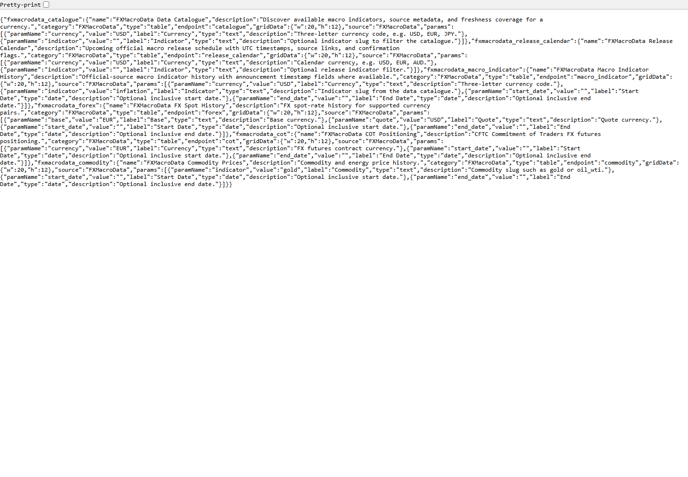
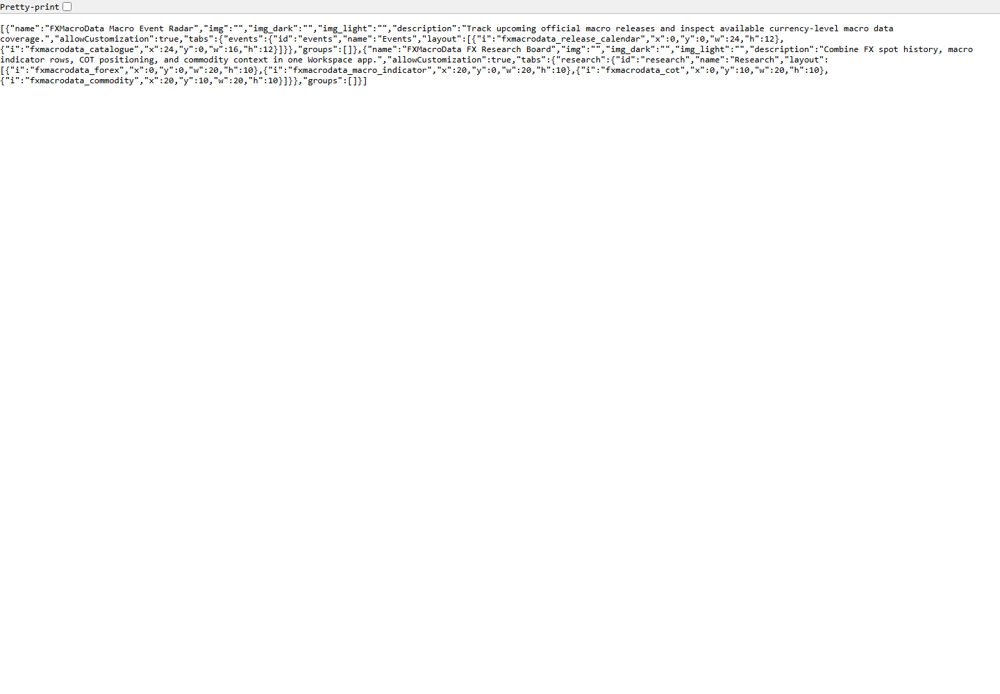
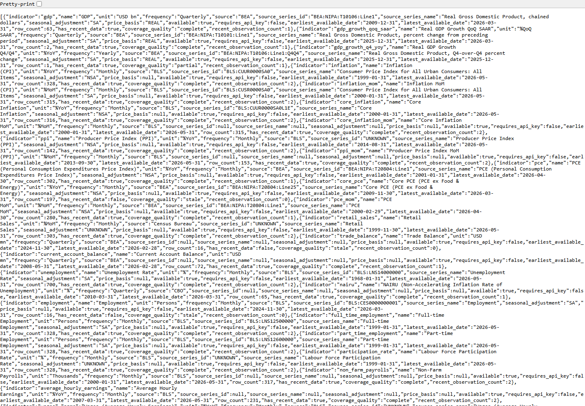
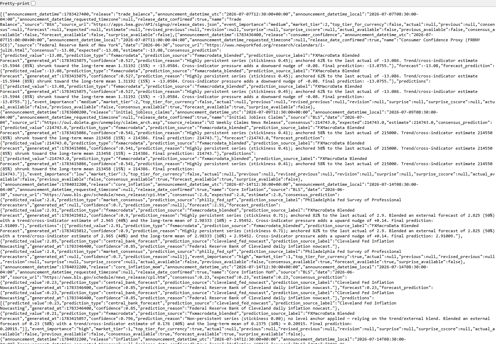

# FXMacroData OpenBB Pre-Release Test Report

Date: 2026-07-07
Repository: `C:\Users\rober\dev\fxmacrodata\fxmacrodata`
Release candidate: `fxmacrodata` 1.2.0

No PyPI publish, GitHub release, tag, or OpenBB submission was performed.

## Summary

| Area | Result | Evidence |
|---|---:|---|
| Local SDK test suite | Pass | `27 passed, 1 skipped in 9.19s` |
| Clean dev environment test suite | Pass | `33 passed, 3 warnings in 9.45s` after `python -m pip install -e ".[dev]"` |
| Lint | Pass | `python -m ruff check fxmacrodata tests` |
| Formatting | Pass | `python -m black --check fxmacrodata tests` |
| Type check | Pass | `python -m mypy fxmacrodata` |
| Python compile check | Pass | `python -m compileall fxmacrodata` |
| Package build | Pass | Built `fxmacrodata-1.2.0.tar.gz` and `fxmacrodata-1.2.0-py3-none-any.whl` |
| Package metadata | Pass | `twine check dist\*` passed for wheel and sdist |
| PR validation workflow | Pass | Added validation-only GitHub Actions workflow for PRs and `codex/**` pushes; no publish/release steps |
| OpenBB entry-point smoke | Pass | Clean environment verified core/provider entry points, provider registration, Workspace widgets, and apps |
| Fresh wheel install, Workspace extra | Pass | Installed `fxmacrodata-1.2.0-py3-none-any.whl[workspace]`; backend functions loaded |
| Fresh wheel install, OpenBB extra | Pass | Installed `fxmacrodata-1.2.0-py3-none-any.whl[openbb]`; provider and router loaded |
| OpenBB build | Pass | `openbb-build` discovered `fxmacrodata@1.2.0` |
| OpenBB Python command, public data | Pass | `obb.fxmacrodata.data_catalogue(currency="USD")` returned `OBBject`, dataframe shape `(46, 17)`, includes `inflation` |
| OpenBB Python commands, protected data | Pass | AUD GDP `(13, 13)`, EUR/USD FX `(20, 6)`, EUR COT `(20, 33)`, gold commodity `(20, 2)` |
| Workspace backend endpoints | Pass | OpenBB Platform API launcher served `/health`, `/widgets.json`, `/apps.json`, and `/catalogue?currency=USD` as `200 OK`; `/docs` and `/openapi.json` returned `404` by default |

## Issues Found And Fixed

| Issue | Fix |
|---|---|
| SDK tests still assumed FX spot history was free, but live API returns `401 api_key_required`. | Updated sync and async clients so `get_fx_price` requires and sends `X-API-Key`; updated README and tests. |
| Build produced another `1.1.0` package. | Bumped release candidate metadata to `1.2.0`. |
| Setuptools warned about deprecated TOML table license syntax. | Changed `license = { text = "MIT" }` to `license = "MIT"`. |
| The previous `httpx2>=0.28` dev dependency was invalid for the current `httpx2` package line. | Corrected it to `httpx2>=2.0` and kept `httpx>=0.24` for OpenBB/test tooling compatibility. |
| Async helper tests depended on a globally installed pytest plugin. | Added `pytest-asyncio>=0.23` to dev requirements and validated in a clean environment. |
| Protected live tests could fail noisily in CI when no API key was configured. | Centralized the API-key skip in the keyed-client fixture and added mocked auth tests for deterministic coverage. |
| The optional OpenBB provider fallback failed `mypy` when `openbb_core` was absent. | Reworked the provider import fallback to avoid assigning `None` to the imported provider class symbol. |
| The repo had no safe PR validation workflow; existing CI/CD only runs on `main`/`dev` and includes release/publish steps. | Added `.github/workflows/pr-validation.yml` with read-only validation on PRs and `codex/**` pushes. |
| The Workspace backend exposed FastAPI Swagger/OpenAPI docs by default. | Disabled `/docs`, `/redoc`, and `/openapi.json` unless `FXMACRODATA_OPENBB_ENABLE_DOCS=1` is set for local debugging. |
| The Workspace backend had not been checked through OpenBB's own API launcher. | Added dev dependency `openbb-platform-api>=1.3.6`, a launcher import test, and a local `openbb-api --app fxmacrodata/openbb/workspace_backend.py --name app` smoke run. |
| Current `openbb-core` rejected router command signatures because postponed annotations hid actual parameter types. | Removed postponed annotations from `fxmacrodata.openbb.router`. |

## Screenshots

### Workspace Widgets JSON

### Workspace Apps JSON

### USD Catalogue Endpoint

### USD Release Calendar Endpoint

## Remaining Before Release Approval

- Optional: test inside a logged-in OpenBB Workspace UI session at `pro.openbb.co`; current screenshots validate the custom backend endpoints, not the hosted OpenBB UI.
- Optional: decide whether to host the Workspace backend publicly over HTTPS or document local-only Workspace usage for the first release.
- Required before merge/release: push the validation branch and confirm the new PR validation workflow passes on GitHub.
- Required before PyPI publish: final approval to publish `fxmacrodata` 1.2.0.
