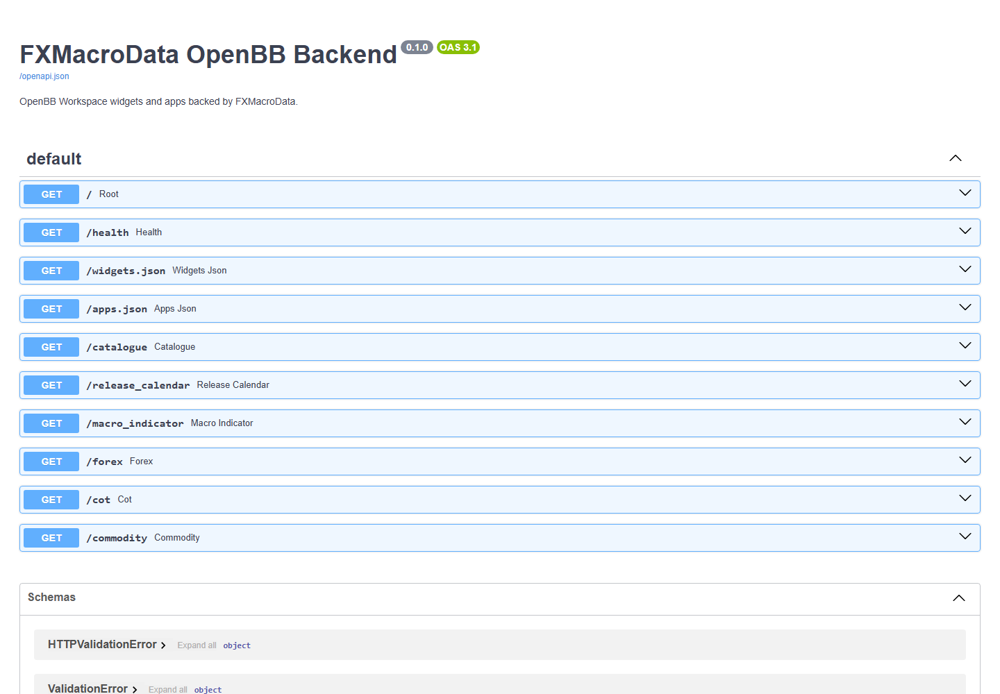

# FXMacroData OpenBB Pre-Release Test Report

Date: 2026-07-07
Repository: `C:\Users\rober\dev\fxmacrodata\fxmacrodata`
Release candidate: `fxmacrodata` 1.2.0

No PyPI publish, GitHub release, tag, or OpenBB submission was performed.

## Summary

| Area | Result | Evidence |
|---|---:|---|
| Full SDK test suite | Pass | `23 passed in 8.53s` |
| Python compile check | Pass | `python -m compileall fxmacrodata` |
| Package build | Pass | Built `fxmacrodata-1.2.0.tar.gz` and `fxmacrodata-1.2.0-py3-none-any.whl` |
| Package metadata | Pass | `twine check dist\*` passed for wheel and sdist |
| Fresh wheel install, Workspace extra | Pass | Installed `fxmacrodata-1.2.0-py3-none-any.whl[workspace]`; backend functions loaded |
| Fresh wheel install, OpenBB extra | Pass | Installed `fxmacrodata-1.2.0-py3-none-any.whl[openbb]`; provider and router loaded |
| OpenBB build | Pass | `openbb-build` discovered `fxmacrodata@1.2.0` |
| OpenBB Python command, public data | Pass | `obb.fxmacrodata.data_catalogue(currency="USD")` returned `OBBject`, dataframe shape `(46, 17)`, includes `inflation` |
| OpenBB Python commands, protected data | Pass | AUD GDP `(13, 13)`, EUR/USD FX `(20, 6)`, EUR COT `(20, 33)`, gold commodity `(20, 2)` |
| Workspace backend endpoints | Pass | `/docs`, `/widgets.json`, `/apps.json`, `/catalogue?currency=USD`, `/release_calendar?currency=USD` all returned `200 OK` |

## Issues Found And Fixed

| Issue | Fix |
|---|---|
| SDK tests still assumed FX spot history was free, but live API returns `401 api_key_required`. | Updated sync and async clients so `get_fx_price` requires and sends `X-API-Key`; updated README and tests. |
| Build produced another `1.1.0` package. | Bumped release candidate metadata to `1.2.0`. |
| Setuptools warned about deprecated TOML table license syntax. | Changed `license = { text = "MIT" }` to `license = "MIT"`. |
| Fresh clean Starlette/FastAPI test environment required `httpx2` for `TestClient`. | Added `httpx2>=0.28` to dev requirements. |
| Current `openbb-core` rejected router command signatures because postponed annotations hid actual parameter types. | Removed postponed annotations from `fxmacrodata.openbb.router`. |

## Screenshots

### FastAPI Docs

### Workspace Widgets JSON

### Workspace Apps JSON

### USD Catalogue Endpoint

### USD Release Calendar Endpoint

## Remaining Before Release Approval

- Optional: test inside a logged-in OpenBB Workspace UI session at `pro.openbb.co`; current screenshots validate the custom backend endpoints, not the hosted OpenBB UI.
- Optional: decide whether to host the Workspace backend publicly over HTTPS or document local-only Workspace usage for the first release.
- Required before PyPI publish: final approval to publish `fxmacrodata` 1.2.0.
