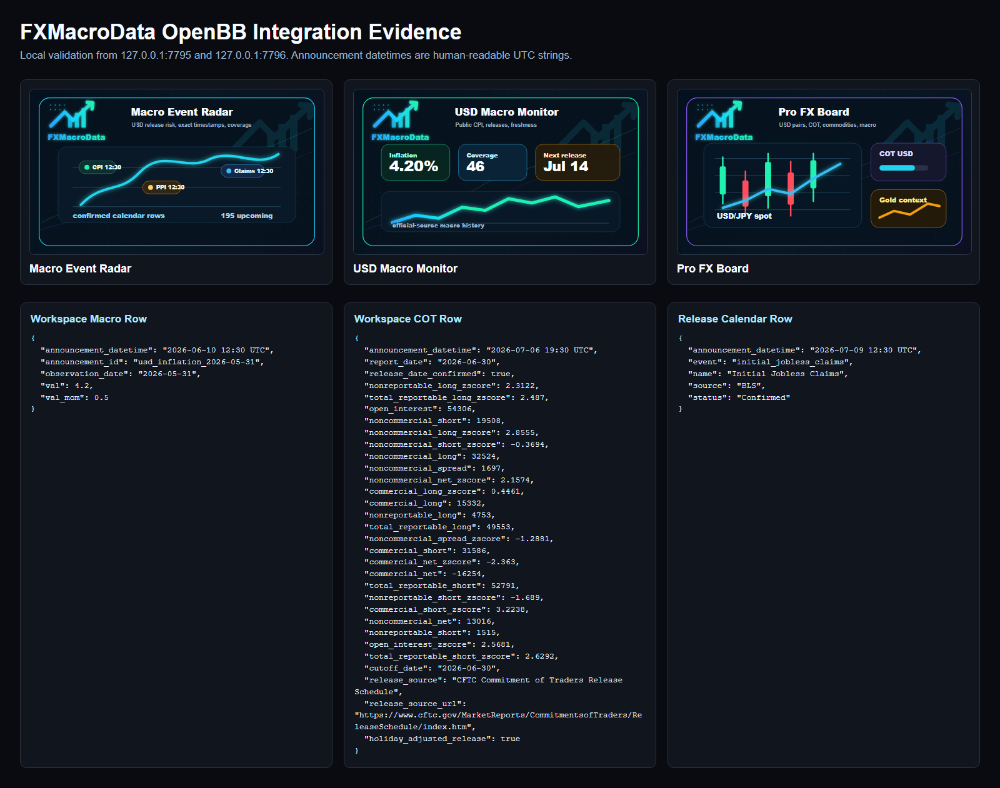
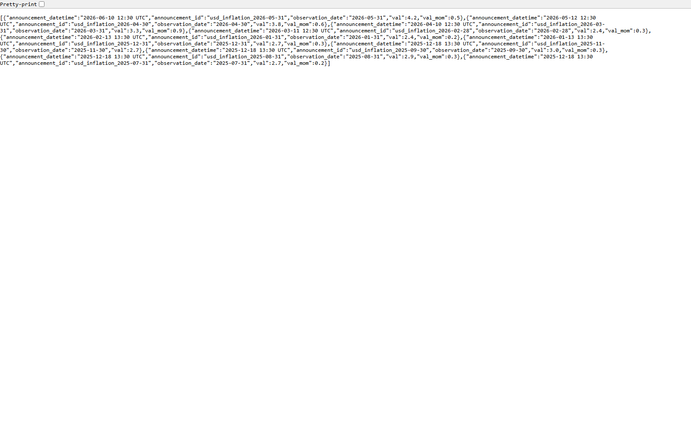
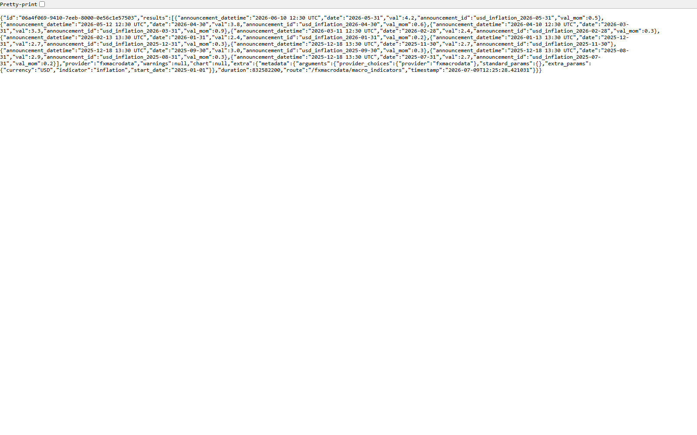

# FXMacroData OpenBB Submission Readiness Report

Date: 2026-07-09
Repository: `C:\Users\rober\dev\fxmacrodata\fxmacrodata`
Release candidate: `fxmacrodata` 1.2.1
Branch: `codex/openbb-pre-release-validation`

No PyPI publish, GitHub release, tag, OpenBB PR, or external push was
performed.

## Summary

| Area | Result | Evidence |
|---|---:|---|
| Full SDK test suite | Pass | `python -m pytest tests -q` returned `39 passed, 2 skipped` |
| Lint | Pass | `python -m ruff check fxmacrodata tests` |
| Formatting | Pass | `python -m black --check fxmacrodata tests` |
| Type check | Pass | `python -m mypy fxmacrodata` in a clean dev validation venv |
| Python compile check | Pass | `python -m compileall -q fxmacrodata` |
| Package build | Pass | Built `fxmacrodata-1.2.1.tar.gz` and `fxmacrodata-1.2.1-py3-none-any.whl` |
| Package metadata | Pass | `python -m twine check dist\*` passed for wheel and sdist |
| Wheel contents | Pass | Wheel includes OpenBB metadata, Workspace backend, datetime helpers, and entry points |
| Fresh wheel install | Pass | Installed built wheel with `openbb-api`, `workspace`, and `mcp` extras in a clean venv |
| OpenBB entry points | Pass | `openbb_core_extension` and `openbb_provider_extension` both expose `fxmacrodata` |
| OpenBB build | Pass | `openbb-build` discovered `fxmacrodata@1.2.1` |
| Generated OpenBB API | Pass | Local API returned USD catalogue, macro history, and release calendar rows |
| Custom Workspace backend | Pass | Installed backend returned `/widgets.json`, `/apps.json`, app image assets, macro, COT, calendar, and release timeline data |
| Human-readable datetimes | Pass | Macro, COT, generated API, and release-calendar rows use `YYYY-MM-DD HH:MM UTC` |
| Workspace visuals | Pass | Three branded app-card images are served from `/assets/openbb-apps/*` |

## Current Evidence Artifacts

- `openbb_submission_visual_evidence.png`: consolidated visual proof of app
  cards and sample rows.
- `openbb_workspace_macro_indicator_7796_current.png`: custom Workspace backend
  macro response on the persistent local backend port.
- `openbb_generated_api_macro_indicator_7795_current.png`: generated OpenBB API
  macro response on the persistent local API port.
- `clean-wheel-workspace-7816.out.log` / `.err.log`: installed-wheel Workspace
  backend smoke logs.
- `clean-wheel-openbb-api-7815.out.log` / `.err.log`: installed-wheel generated
  OpenBB API smoke logs.

## Issues Found And Fixed

| Issue | Fix |
|---|---|
| OpenBB-facing `announcement_datetime` values displayed raw epoch seconds in tables. | Added shared datetime parsing/formatting helpers and normalized macro, COT, calendar, FX, and commodity rows for OpenBB presentation. |
| Same-day macro widgets returned `NO_DATA_IN_REQUESTED_WINDOW` when the latest observation lagged the selected date. | Added a Workspace backend retry path that uses the API-provided recommended/latest available window for that specific same-day error. |
| Workspace app cards had no images or basic placeholders. | Added three branded SVG app-card previews served through `/assets/openbb-apps/*`. |
| Calendar widgets were only plain tables. | Added `release_calendar_timeline`, a stacked Plotly release radar chart with release categories and UTC hover text. |
| Widget defaults requested non-USD datasets that require a paid API key. | Changed Workspace defaults to USD-first (`USD/JPY`, USD COT, USD macro history) and documented non-USD as authenticated usage. |
| Custom backend root and OpenBB module still reported `0.1.0`. | Wired both to package metadata so the installed wheel reports `1.2.1`. |
| Local validation generated `.pid` files and dist-validation directories as untracked noise. | Added targeted `.gitignore` rules for local OpenBB validation artifacts. |
| The OpenBB submission route was ambiguous. | Added `docs/openbb-github-submission.md` with the recommended catalogue PR, provider JSON draft, README row, PR body, and approval gates. |

## Screenshots

### OpenBB Submission Visual Evidence

### Custom Workspace Macro Endpoint

### Generated OpenBB API Macro Endpoint

## Remaining Before External Submission

- Approval to commit and push the SDK branch.
- Approval to publish/release `fxmacrodata` 1.2.1 to PyPI.
- Approval to open the OpenBB upstream catalogue/listing PR.
- Optional maintainer follow-up: build an in-tree `openbb_platform/providers/fxmacrodata`
  package only if OpenBB maintainers request it.
